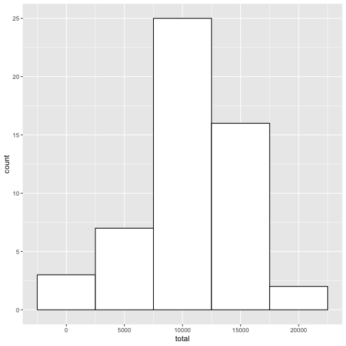
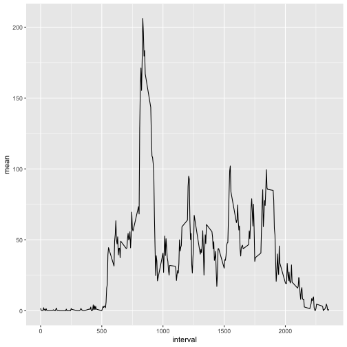
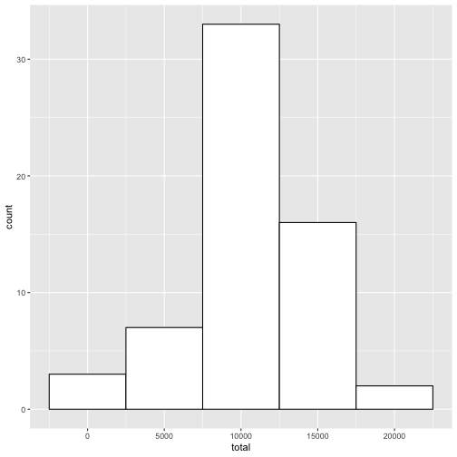
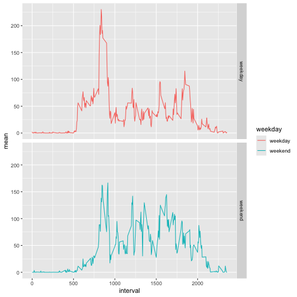

## Reproducible Research - Coursera
## Course Project 2

### Loading and preprocessing the data

``` r
library(dplyr)
library(ggplot2)

data <- read.csv('activity.csv')

data$date <- as.POSIXct(data$date, format = '%Y-%m-%d')
```

### What is mean total number of steps taken per day?


``` r
dailySteps <- data %>%
  filter(!is.na(steps)) %>%
  group_by(date) %>%
  summarize(
    total = sum(steps, na.rm = TRUE),
    mean = mean(steps, na.rm = TRUE),
    median = mean(steps, na.rm = TRUE)
  )

plot_daily <- ggplot(
  dailySteps,
  aes(total)
) +
  geom_histogram(
    binwidth = 5000, color = 'black', fill = 'white'
  )
plot_daily
```



``` r
print(
  paste0(
    'The mean of daily steps is ',
    mean(dailySteps$total)
  )
)
```

```
## [1] "The mean of daily steps is 10766.1886792453"
```

``` r
print(
  paste0(
    'The median of daily steps is ',
    median(dailySteps$total)
  )
)
```

```
## [1] "The median of daily steps is 10765"
```


### What is the average daily activity pattern?

``` r
intervalSteps <- data %>%
  group_by(interval) %>%
  summarize(
    mean = mean(steps, na.rm = TRUE)
  )

plot_interval <- ggplot(
  intervalSteps,
  aes(
    x = interval,
    y = mean
  )
) +
  geom_line()
plot_interval
```



``` r
print(
  paste0(
    'The interval with the maximum steps is ',
    intervalSteps[
      which(intervalSteps$mean == max(intervalSteps$mean)),
      1
      ]
    )
  )
```

```
## [1] "The interval with the maximum steps is 835"
```

### Imputing missing values


``` r
print(
  paste0(
    'The number of rows with NA values is ',
    length(which(is.na(data$steps)))
  )
)
```

```
## [1] "The number of rows with NA values is 2304"
```


``` r
for (i in 1:nrow(data)) {
  if (is.na(data[i, 1])){
    data[i, 1] <- intervalSteps[intervalSteps$interval == data[i,3], ]$mean
  }
}

dailySteps2 <- data %>%
  group_by(date) %>%
  summarize(
    total = sum(steps, na.rm = TRUE),
    mean = mean(steps, na.rm = TRUE),
    median = mean(steps, na.rm = TRUE)
  )

plot_daily2 <- ggplot(
  dailySteps2,
  aes(total)
) +
  geom_histogram(
    binwidth = 5000, color = 'black', fill = 'white'
  )

plot_daily2
```



``` r
print(
  paste0(
    'The mean of daily steps before changing NA values is ',
    mean(dailySteps$total),
    '; after - ',
    mean(dailySteps2$total)
  )
)
```

```
## [1] "The mean of daily steps before changing NA values is 10766.1886792453; after - 10766.1886792453"
```

``` r
print(
  paste0(
    'The median of daily steps before changing NA values is ',
    median(dailySteps$total),
    '; after - ',
    median(dailySteps2$total)
  )
)
```

```
## [1] "The median of daily steps before changing NA values is 10765; after - 10766.1886792453"
```

``` r
wkdays <- list('Monday', 'Tuesday', 'Wednesday', 'Thursday', 'Friday')
wkends <- list('Saturday', 'Sunday')

for (i in 1:nrow(data)) {
  if (weekdays(data[i, 2]) %in% wkdays) {
    data$weekday[i] <- 'weekday'
  } else if (weekdays(data[i, 2]) %in% wkends) {
    data$weekday[i] <- 'weekend'
  }
}

wkdayInterval <- data %>%
  group_by(weekday, interval) %>%
  summarize(
    mean = mean(steps, na.rm = TRUE)
  )
```

```
## `summarise()` has grouped output by 'weekday'. You can override using the `.groups`
## argument.
```

``` r
plot_interval2 <- ggplot(
  wkdayInterval,
  aes(
    x = interval,
    y = mean,
    color = weekday
  )
) +
  geom_line() +
  facet_grid(weekday~.)

plot_interval2
```


